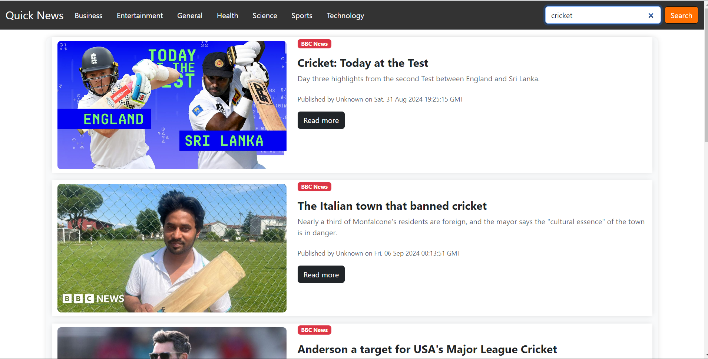
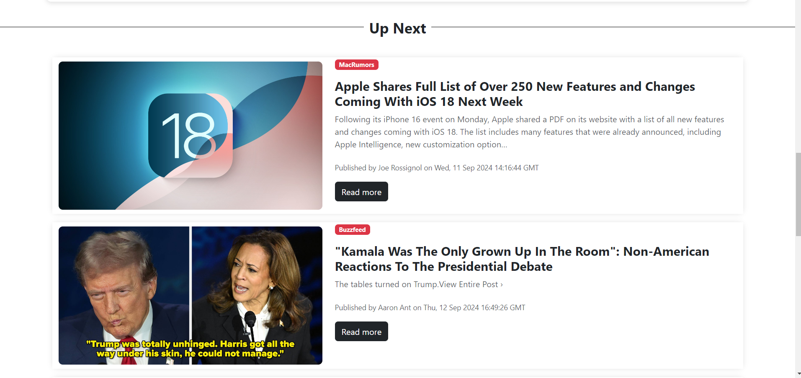
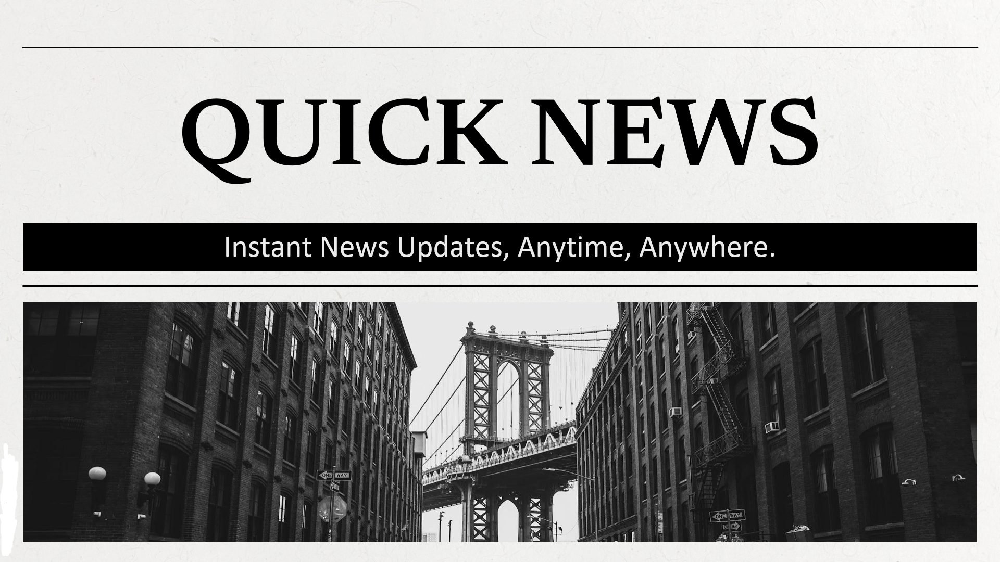
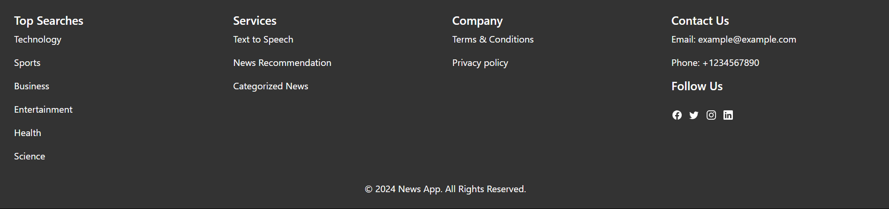
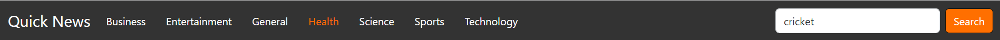

# Innovative News App

The Innovative News App is a cutting-edge web application designed to transform the way people consume news in today's fast-paced digital world. Developed by Aayush Dushane this app offers a seamless and user-friendly platform for accessing diverse news content.

## Key Features

#### News Aggregation: 
The app fetches articles from various reputable sources, providing users with a comprehensive view of current events across different categories.

#### Text-to-Speech Functionality: 
A standout feature that converts text articles into audio, allowing users to listen to news. This enhances accessibility and caters to users who prefer auditory learning or have visual impairments.

#### Related Article Recommendations: 
The app suggests related articles based on the user's current reading, encouraging deeper exploration of topics.

#### User-Friendly Interface: 
Built with React.js, the interface ensures smooth navigation and an engaging user experience.
#### Responsive Design:
Accessible on various devices, from smartphones to desktop computers.

## Technical Architecture

**Frontend:** Developed using React.js, creating a dynamic and responsive user interface.

**Backend:** Powered by Flask, a Python web framework, handling data processing and API interactions.

**External APIs:** Integrates with news APIs for content retrieval and Text-to-Speech APIs for audio conversion.

## Core Components

- `News.js`: Manages the fetching and display of news articles.
- `NewsDescription.js`: Presents detailed views of individual news items.
- `NewsItem.js`: Renders concise previews of news articles.
- `Recommendation.js`: Implements the related articles feature.
- `NavBar.js`: Facilitates easy navigation through the app.
- `Footer.js`: Provides additional resources and navigation options.## Screenshots

### Category View

*News articles categorized for easy browsing*

### Article View

*Detailed view of a selected news article*

### Recommendations

*Related article recommendations for further reading*

### Banner

*The app's banner showcasing "QUICK NEWS"*

### Footer

*Footer section with additional navigation and information*

### Navigation Bar

*Navigation bar for easy access to different sections of the app*